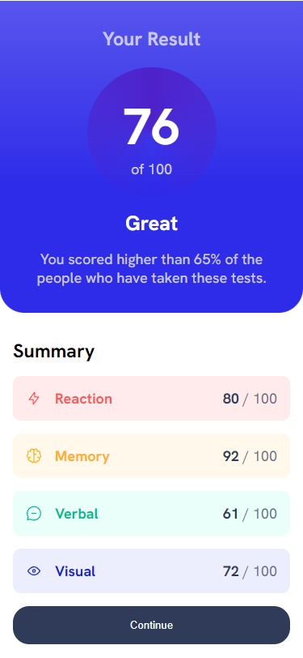
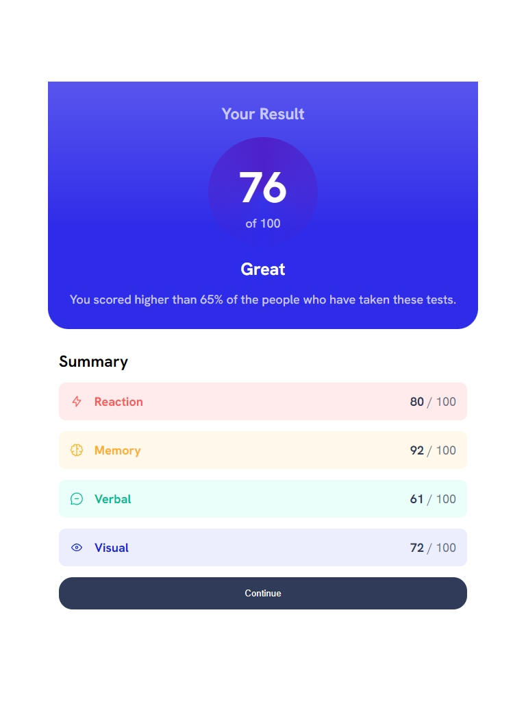
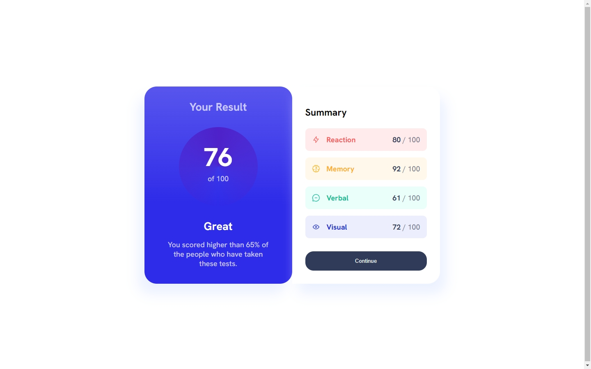

# Result-Summary-Component

This is a solution to the [ Result Summary component challenge on Frontend Mentor](https://www.frontendmentor.io/challenges/order-summary-component-QlPmajDUj/hub). Frontend Mentor challenges help you improve your coding skills by building realistic projects.

## Table of contents

- [Result-Summary-Component](#result-summary-component)
  - [Table of contents](#table-of-contents)
  - [Overview](#overview)
    - [Screenshot](#screenshot)
    - [Links](#links)
    - [Built with](#built-with)
  - [Author](#author)
  - [Acknowledgments](#acknowledgments)

## Overview

Order Summary Component is a Solution to a beginner project on FrontEnd MEntor using HTML $ CSS only.

### Screenshot

### Links

- Solution URL: [FrontEnd MEntor](https://www.frontendmentor.io/solutions/order-summarry-component-using-html-and-css-only-apxEXqQMS3)
- Live Site URL: [Github webpage](https://bodv6.github.io/Result-Summary-Component/)

### Built with

- Semantic HTML5 markup
- CSS custom properties
- Flexbox
- Mobile-first workflow

## Author

- Github - [@bodV6](https://github.com/bodV6)
- Frontend Mentor - [@bodV6](https://www.frontendmentor.io/profile/bodV6)
- Twitter - [@bodVr6](https://www.twitter.com/bodVr6)

## Acknowledgments

-Thanks to the frontEnd Mentor team for the free Challenges
